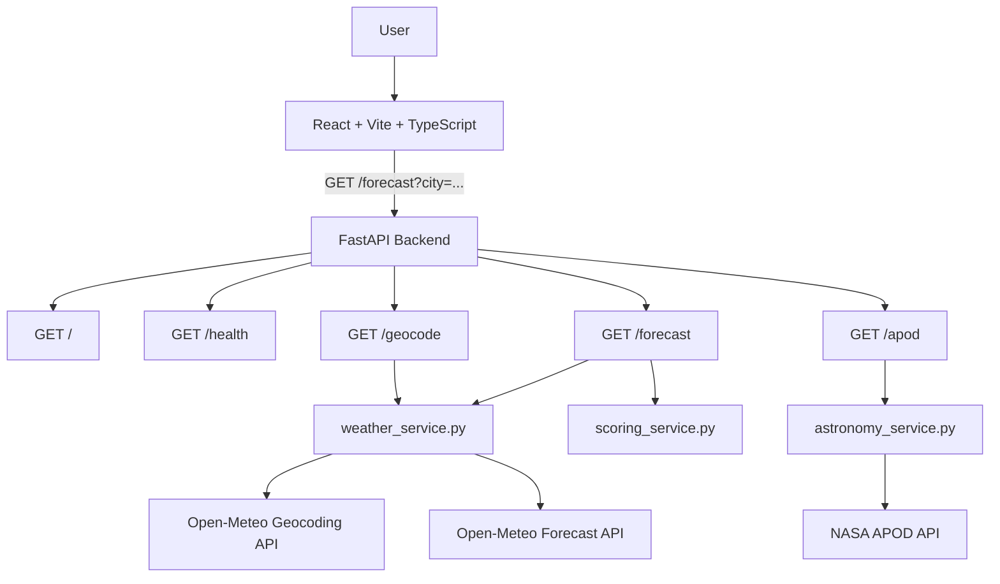
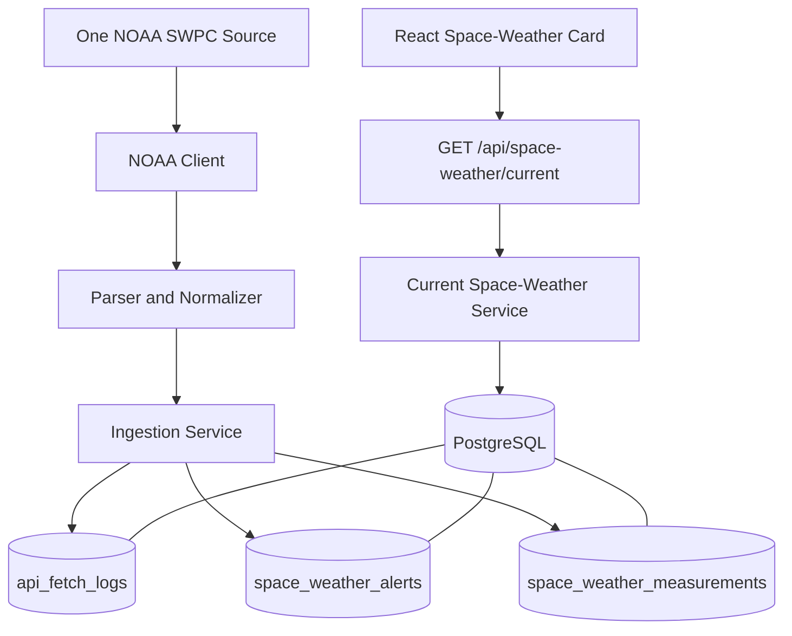

# AstroCast Architecture

## Purpose

This document records the current Week 1 architecture before PostgreSQL and NOAA ingestion are added. It serves as the regression baseline for Week 2.

## Current System Diagram

## Current Request Flow

### Local forecast

1. The frontend sends `GET /forecast?city=<city>`.
2. FastAPI calls `get_forecast_for_city`.
3. `weather_service.py` geocodes the city.
4. The service uses the first Open-Meteo geocoding result.
5. The service requests two days of hourly forecast data.
6. The service selects 10:00 PM on the first available forecast date.
7. Visibility is converted from meters to miles.
8. `scoring_service.py` calculates the score and explanation.
9. FastAPI returns normalized JSON.
10. The frontend renders the result.

### NASA APOD

1. FastAPI receives `GET /apod`.
2. `astronomy_service.py` calls NASA's APOD endpoint.
3. The NASA key is loaded from `NASA_API_KEY`.
4. When the variable is absent, `DEMO_KEY` is used.
5. The backend returns selected APOD fields.

## Backend Responsibilities

### `backend/main.py`

- Creates the FastAPI application
- Configures CORS
- Declares the current routes
- Delegates business logic to service modules

Allowed frontend development origins currently include ports `5173` and `5174`.

### `backend/services/weather_service.py`

- Calls Open-Meteo geocoding
- Calls Open-Meteo weather forecasting
- Selects the forecast hour
- Converts visibility units
- Constructs the normalized local forecast response

### `backend/services/scoring_service.py`

- Calculates a score from 0 to 100
- Applies penalties for cloud cover, precipitation, wind, and visibility
- Assigns a rating
- Builds a plain-English explanation

### `backend/services/astronomy_service.py`

- Loads the NASA API key
- Calls NASA APOD
- Converts external failures into HTTP 502 responses
- Returns a selected APOD response shape

## Frontend Responsibilities

### `frontend/src/api/astrocastApi.ts`

- Defines the TypeScript forecast contract
- Sends the forecast request
- Converts unsuccessful responses into JavaScript errors

### `frontend/src/App.tsx`

- Stores city, forecast, loading, and error state
- Validates that a city was entered
- Calls the forecast API
- Displays the score, weather conditions, explanation, and location

## External Dependencies

| Dependency | Current Purpose |
|---|---|
| Open-Meteo Geocoding | Convert city name to coordinates |
| Open-Meteo Forecast | Retrieve hourly local weather |
| NASA APOD | Retrieve daily astronomy content |

## Current Data Characteristics

- Data is fetched synchronously during each request.
- No external response is persisted.
- No historical records are available.
- No ingestion process exists.
- No fetch attempt is logged.
- No deduplication rules exist.

## Current Limitations and Risks

### Ambiguous city names

The geocoding request uses `count=1`, and the service automatically accepts the first match. A user entering a common city name may receive a forecast for the wrong location.

Future improvement:

- Return multiple geocoding matches
- Display city, region, and country
- Let the user select one location
- Request the forecast using the selected coordinates

### Fixed forecast-hour selection

The application selects 10:00 PM on the first forecast day. Depending on the current time, that timestamp may not represent the next useful observing period.

### Frontend error state

`App.tsx` correctly clears `forecast` before requesting new data. When an invalid city is entered, the error is shown and the three default result cards remain visible. The values are placeholders, but the layout may still confuse users.

### Placeholder frontend modules

`ApodCard.tsx`, `ForecastCard.tsx`, `ScoreCard.tsx`, `SearchBar.tsx`, and `mockAstroData.ts` are currently not integrated into `App.tsx`.

## Week 2 Target Architecture

The existing request-time forecast flow will remain functional. A separate persistence and ingestion path will be added.

## Architecture Guardrails for Week 2

- Do not replace FastAPI.
- Do not create tables manually as the primary setup method.
- Use Alembic migrations.
- Integrate one NOAA source.
- Normalize external data before storing it.
- Add database constraints that support deduplication.
- Record every ingestion attempt.
- Keep the local forecast route working.
